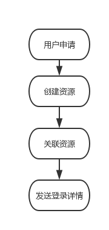
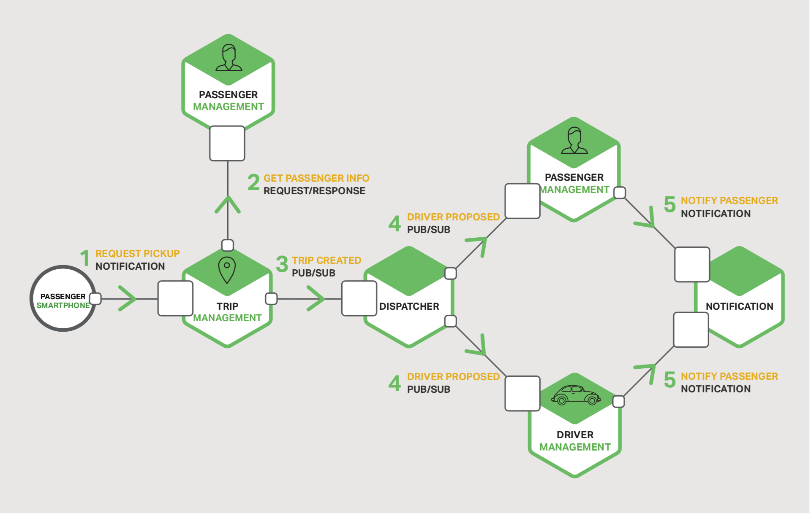
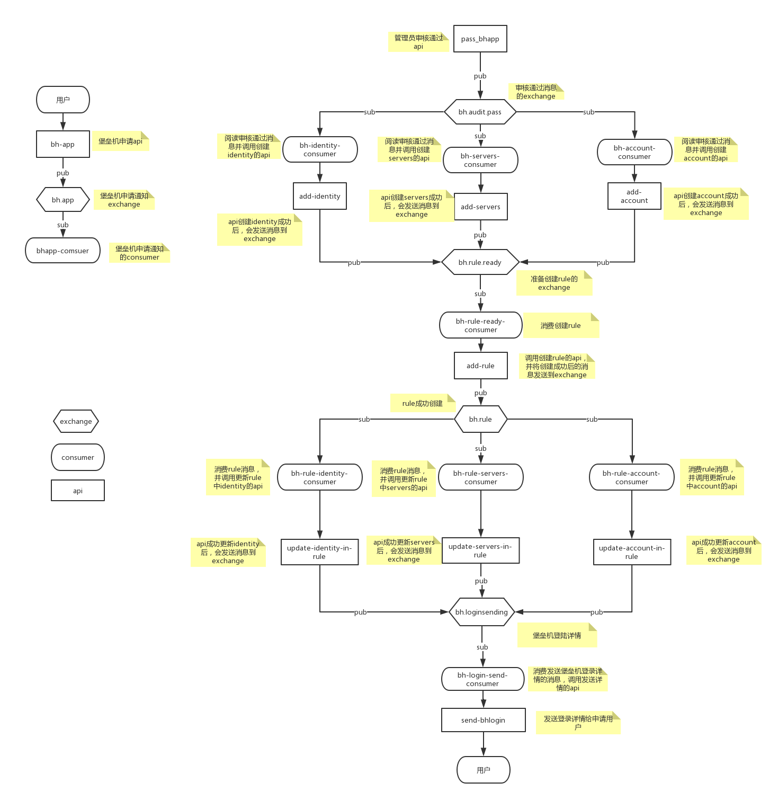

上一章节，对业务功能进行了简要说明；
这一章节，将介绍业务实现中最具有挑战性的模块（资源创建与关联）；

通过第三方的api文档可以看出，操作任何资源，都是独立的操作，这样，就增加了整个系统服务的数量。大概可以看出，至少有六七个接口。

但是我们可以总结出以下关键的几点：
一个申请创建的同时，可能需要调用好几个接口
每一个接口之间，没有直接调用的联系
在步骤创建资源中的接口，并不关心关联资源中的接口
创建资源步骤只需要向关联资源步骤发送请求，但两者之间都不关心对方的状态
整个流程可以是异步的，并不需要一定控制在毫秒级的调用链

候选方案
一：
使用传统，很暴力的实现方式，完全顺序执行：

此方案有几个问题：
编写复杂，任何一个独立的步骤，将需要调用几个接口，调试与编写都很困难
接口之间，如果用同步实现，很难保证可用性
子操作太粗，比如创建资源中的某个一个操作，创建账号失败，如果想再次创建账号，则需要再重新通过创建资源的流程
拓展性差，如果需要更新某个步骤中的某一个子操作，则需要与同步骤的接口一起调试

二：
IPC(Inter-Process Communication)（进程通信）方案

下图，是实际应用中，一个很好的通过订阅，推送机制，来实现复杂业务场景的例子。

从此图可以看出，
业务逻辑之间，通过推送与订阅的机制来进行消息沟通，一对多，还是一对一，只依赖具体的业务场景
由于划分了众多子步骤，可以允许多语言开发，极大的提高了协作效率
子操作更新，则只需要更新此子操作，而不会影响其他模块、
添加新接口，只需要添加一个订阅，消息的推送方完全不需要关心消费者
有同步响应，也有异步通信

方案实现：
通过上节介绍的两个方案，可以看出，方案二更适合我们的业务场景。
注：在上一篇中，前端页面的向导模式申请的验证，如人员，资产等，只需在页面里调用相应接口与添加步骤审核，所以在这里就不再详细介绍。

下图将展示我们最终的设计流程图方案:

[查看大图](https://www.processon.com/view/link/5c492dbfe4b056ae29fb2676)
图解：
1：用户提交申请（调用相应的api），api将推送消息到exchange，相应的consumer将消费消息（向每一个管理员发送邮件）
2：管理员点击相应的链接（调用审核通过api），api发送相应的消息到exchange，每一个消费者调用相应的api，资源创建成功后，会发送相应的消息到exchange。

说明:
1：每一个子操作都独立
2：层级之间的通信完全通过推送/订阅
3：由于每个操作都独立，无需统一框架与语言
4：子操作的更新，修改，维护都异常简单

下一章节，我们将介绍流程图中的几个在实现过程中需要解决的核心问题与架构优化
